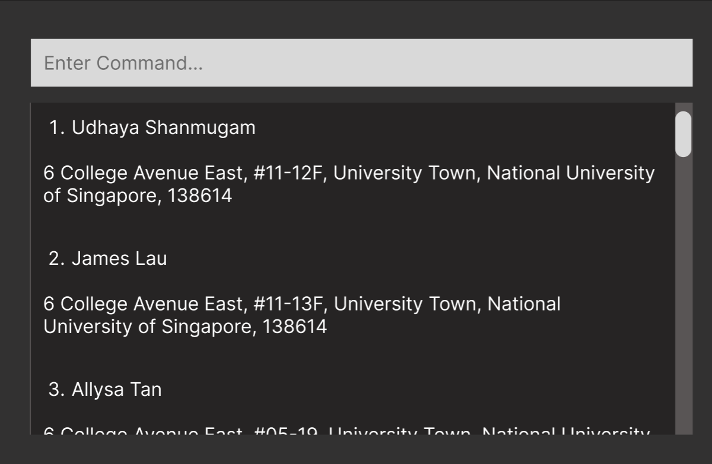

Realodex (or RDX for short) is a **desktop app for managing client contacts, optimized for use via a
Command Line Interface** (CLI) while still having the benefits of a Graphical User Interface (GUI).
If you can type fast, RDX can get your contact management tasks done faster than traditional GUI apps.

<!-- * Table of Contents -->
<page-nav-print />

--------------------------------------------------------------------------------------------------------------------

## Quick start

1. Ensure you have Java `11` or above installed in your computer.

1. Download the latest `realodex.jar` from [here](https://github.com/se-edu/addressbook-level3/releases).

1. Copy the file to the folder you want to use as the _home folder_ for your Realodex.

1. Open a command terminal, `cd` into the folder you put the jar file in, and use the `java -jar realodex.jar`
command to run the application. 
   A GUI similar to the below should appear in a few seconds. Note how the app contains some sample data. 
   

1. Some example commands you can try:

   * `add n/John Doe p/98765432 i/20000 e/johnd@example.com a/311, Clementi Ave 2, #02-25 f/4 t/buyer r/Owes money.`
   Adds a contact named `John Doe` to Realodex.

   * `delete John Doe` : Deletes the client with name `John Doe` from Realodex.

1. Refer to the [Features](#features) below for details of each command.

--------------------------------------------------------------------------------------------------------------------

## Features

<box type="info" seamless>

**Notes about the command format:** 

| Command Format | Representation                                       | Examples                                                                      |
|----------------|------------------------------------------------------|-------------------------------------------------------------------------------|
| `UPPER_CASE`   | Parameters to be supplied by the user.               | in `add n/NAME`, `NAME` is a parameter which can be used as `add n/John Doe`. |
| `[]`           | Parameters enclosed in square brackets are optional. | `add [r\REMARK]` means remark does not need to be supplied.                   |

* If you are using a PDF version of this document, be careful when copying and pasting commands that span multiple lines as space characters surrounding line-breaks may be omitted when copied over to the application.

</box>

### Adding a client: `add`

| Action    | Adds a client to Realodex.                                                                                                                                                                                                                                                                                                                                        |
|:----------|:------------------------------------------------------------------------------------------------------------------------------------------------------------------------------------------------------------------------------------------------------------------------------------------------------------------------------------------------------------------|
| Format    | `add n/NAME p/PHONE i/INCOME e/EMAIL a/ADDRESS f/FAMILY t/TAG [r/REMARK]`                                                                                                                                                                                                                                                                                         |
| Notes     | - Note that `REMARK` is optional, enclosed in `[]`.   - You may input the parameters in any order (e.g. if   the command specifies `n/NAME a/ADDRESS`, `a/ADDRESS n/NAME` is also acceptable).   - Note that the tag is to indicate if a client is a  Buyer, Seller or both, so tags only accept "buyer" or "seller" as the input (case-insensitive). |
| Examples  | * `add n/John Doe p/98765432 i/20000 e/johnd@example.com a/311, Clementi Ave 2, #02-25 f/4 t/Buyer r/Owes $1000.`   * `add n/Betsy Crowe a/Newgate Prison i/$0 f/1 p/94859694 e/betsyc@rocketmail.com t/Seller t/Buyer`                                                                                                                                        |

### Deleting a client : `delete`

Deletes the specified client from Realodex. There are 2 ways to do so: 

| Action   | Deleting by **name**                                                                                                                          |
|:---------|:----------------------------------------------------------------------------------------------------------------------------------------------|
| Format   | `delete n/NAME`                                                                                                                               |
| Notes    | * Deletes the client of the specified `NAME` in Realodex.   * If name is **not found**, error message will be shown `"NAME" is not found`. |
| Examples | `delete n/Udhaya Shanmugam` deletes the client in Realodex with the name "Udhaya Shanmugam".                                                  |

| Action   | Deleting by **index**                                                                                                                                                     |
|:---------|:--------------------------------------------------------------------------------------------------------------------------------------------------------------------------|
| Format   | `delete INDEX`                                                                                                                                                            |
| Notes    | * Deletes the client of the specified `INDEX` in Realodex.   * If the index number is **invalid**, error message will be shown `The client index provided is invalid`. |
| Examples | `delete 4` deletes the 4th client listed in Realodex, provided he/she exists.                                                                                             |

### Editing clients : `edit`

| Action   | Edits specified details of the client.                                                                                                                                                                                                                                 |
|:---------|:-----------------------------------------------------------------------------------------------------------------------------------------------------------------------------------------------------------------------------------------------------------------------|
| Format   | `edit INDEX [n/NAME] [p/PHONE] [i/INCOME] [e/EMAIL] [a/ADDRESS] [f/FAMILY] [t/TAG] [r/REMARK]`                                                                                                                                                                         |
| Notes    | - If `INDEX` is `3`, the 3rd client's information will be edited. - It is optional to edit any field (i.e, you can choose to edit any combination of fields so long there is at least 1). - The current information will be overwritten with the input provided. |
| Examples | - `edit 1 p/999` will overwrite the 1st client's phone number to `999`. - `edit 2 n/Kylie  i/3333 f/5` will overwrite the 2nd client's name to `Kylie`, income to `3333` and family size to `5`.                                                                    |
|

### Filtering clients : `filter`

| Action   | Filters the list of client with an input keyphrase.                                                                                                                                                                                               |
|:---------|:--------------------------------------------------------------------------------------------------------------------------------------------------------------------------------------------------------------------------------------------------|
| Format   | `filter KEYPHRASE`                                                                                                                                                                                                                                |
| Notes    | - The search is case-insensitive. e.g `james` will match `James` - Partial words will still be matched e.g. `Udh` will match `Udhaya` - All persons' names containing the keyword will be returned e.g. `Al` will return `Alicia`, `Allysa` |
| Examples | `filter Al` will list out persons whose name has `"Al"` inside, such as `"Alicia"`, `"Allysa"` and `"Jamal"`                                                                                                                                      |

### Listing clients : `list`

| Action    | Lists all clients in Realodex.                                                                                                                                                                                                                                                                                                                              |
|:----------|:------------------------------------------------------------------------------------------------------------------------------------------------------------------------------------------------------------------------------------------------------------------------------------------------------------------------------------------------------------------|
| Format    |`list`                                                                                                                                                                                                                                                            |
| Notes     |
| Examples  |                                                                                                 |

### Help : `help`

| Action   | Generates a pop-up window which is a summarised version of the User Guide. |
|:---------|:---------------------------------------------------------------------------|
| Format   | `help`                                                                     |
| Notes    |
| Examples |                                                                            |

## Exiting the program : `exit`

### Details

| Action | Exits the program. |
| --- | --- |
| Format | exit |

### **Errors you may face:**

| What went wrong                 | Wrong input example | Error message                                         |
|---------------------------------|---------------------|-------------------------------------------------------|
| Both index and name is provided | delete 1 n/NAME     | "Please provide either an index or a name, not both.” |
| Invalid index provided          |                     |                                                       |

---

# Data Processing

### Saving the data

Realodex data is saved in the hard disk automatically after any command that modifies it. There is no need to save manually.

### Editing the data file

Realodex data is saved automatically as a JSON file `[JAR file location]/data/realodex.json`. Advanced users are welcome to update data directly by editing that data file.

<aside>
⚠️ If your changes to the data file makes its format invalid, Realodex will discard all data and start with an empty data file at the next run. Hence, it is recommended to make a backup of the file before editing it. Only edit the data file only if you are confident that you can update it correctly.

</aside>

---

## FAQ

**Q**: How do I transfer my data to another
Computer?

**A**: Install the app in the other computer
and overwrite the empty data file it creates with the file that contains
the data of your previous AddressBook home folder.

---

## Known issues

1. **When using multiple screens**, if you move the
   application to a secondary screen, and later switch to using only the
   primary screen, the GUI will open off-screen. The remedy is to delete
   the `preferences.json` file created by the application before
   running the application again.

---

## Command summary

| Action            | Format                                                                                       | Examples                                                                                                      |
|-------------------|----------------------------------------------------------------------------------------------|---------------------------------------------------------------------------------------------------------------|
| add               | add n/NAME p/PHONE i/INCOME e/EMAIL a/ADDRESS f/FAMILY t/TAG [r/REMARK]                      | add n/John Doe p/98765432 i/20000 e/johnd@example.com a/311, Clementi Ave 2, #02-25 f/4 r/Buyer t/Owes $1000. |
| delete (by Name)  | delete n/NAME                                                                                | delete n/John                                                                                                 |
| delete (by Index) | delete INDEX                                                                                 | delete 3                                                                                                      |
| edit              | edit INDEX [n/NAME] [p/PHONE] [i/INCOME] [e/EMAIL] [a/ADDRESS] [f/FAMILY] [t/TAG] [r/REMARK] | edit 2 n/Denzel i/100000                                                                                      |
| filter            | filter NAME_SUBSTRING                                                                        | filter David                                                                                                  |
| list              | list                                                                                         | -                                                                                                             |
| help              | help                                                                                         |                                                                                                               |
| exit              | exit                                                                                         |                                                                                                               |

## Prefix Summary

| Prefix                                                                                                 | Field   | Constraints                                                                                                                                                                                                                                                                                                                                                                                                                                                                                                                                                                                                                      |
|--------------------------------------------------------------------------------------------------------|---------|----------------------------------------------------------------------------------------------------------------------------------------------------------------------------------------------------------------------------------------------------------------------------------------------------------------------------------------------------------------------------------------------------------------------------------------------------------------------------------------------------------------------------------------------------------------------------------------------------------------------------------|
| n/                                                                                                     | Name    | Should only contain alphanumeric characters and spaces, and it should not be blank                                                                                                                                                                                                                                                                                                                                                                                                                                                                                                                                               |
| p/                                                                                                     | Phone   | Should only contain numbers, and it should be at least 3 digits long                                                                                                                                                                                                                                                                                                                                                                                                                                                                                                                                                             |
| i/                                                                                                     | Income  | Should be an integer and should be at least 0                                                                                                                                                                                                                                                                                                                                                                                                                                                                                                                                                                                    |
| e/                                                                                                     | Email   | Emails should be of the format local-part@domain   1. The local-part should only contain alphanumeric characters and these special characters, excluding (+_.-) 2. The local-part may not start or end with any special characters 3. This is followed by a '@' and then a domain name. The domain name is made up of domain labels separated by periods. 4. The domain name must: - end with a domain label at least 2 characters long - have each domain label start and end with alphanumeric characters - have each domain label consist of alphanumeric characters, separated only by hyphens, if any. |
  | a/                                                                                                     | Address | Addresses can take any values, and it should not be blank                                                                                                                                                                                                                                                                                                                                                                                                                                                                                                                                                                        |
  | f/                                                                                                     | Family  | Family size should be at least 1                                                                                                                                                                                                                                                                                                                                                                                                                                                                                                                                                                                                 |
  | t/                                                                                                     | Tag     | Tag names should be either 'buyer' or 'seller'"                                                                                                                                                                                                                                                                                                                                                                                                                                                                                                                                                                                  |
  | r/                                                                                                     | Remark  | Remarks should be non-empty                                                                                                                                                                                                                                                                                                                                                                                                                                                                                                                                                                                                      |

 ⚠️  Remarks are optional to add, but once you use the prefix r/ to add a remark, it should not be blank                                                                                                                                                                                                                                                                                                                                                                                                                                                                                                                                                                                                                               

---
