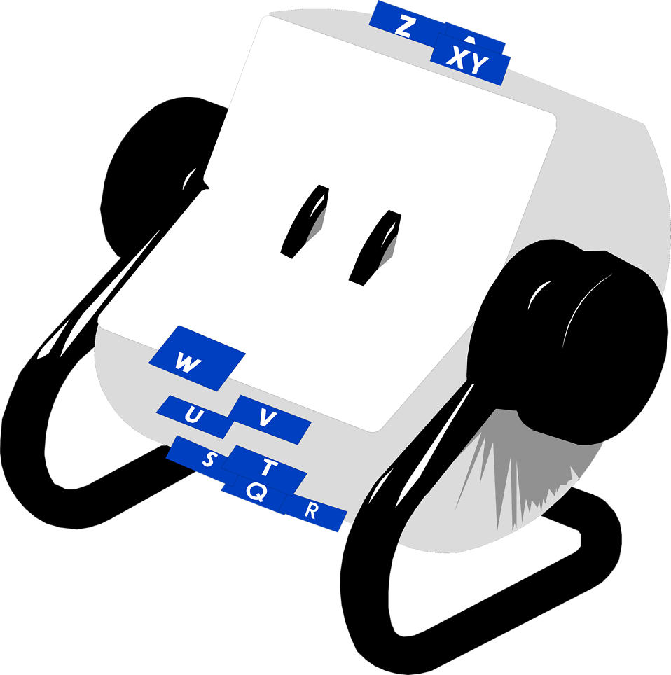

# Realodex UserGuide

# Welcome to `Realodex` v1.3 User Guide!

> Realodex: The trusty sidekick for real estate agents to turbocharge client management. This user guide is the roadmap to mastering **Realodex** and unlocking a new level of productivity  in client management 🚀💼
>

# Table of Contents

# Using this Guide

To ensure you have a smooth and intuitive experience, this guide utilizes specific formatting conventions and icons. Familiarizing yourself with these will enhance your understanding and efficiency as you navigate through the functionalities of Realodex.

### Formatting Conventions

Throughout this guide, we employ a consistent set of formatting styles to denote different types of information:

- **Bold**: Used to draw attention to key concepts and actions you need to perform. When you see text in **bold**, it emphasises important information.
- *Italics*: Reserved for introducing new terms and phrases that are essential to understanding **Realodex**. Italicized text may also appear in subheadings beneath screenshots to succinctly describe what you're seeing in the image.
- **`Code blocks`**: Actual commands that you may enter into the Realodex CLI will be referred to in these code blocks.
- [ ]  Checklists:

### Legend of Icons

| Icon | Meaning |
| --- | --- |
| ⚠️ | Warning for potential pitfalls or important considerations that could impact the Realodex user experience. |
| 💡 | Tips, helpful suggestions, best practices, and insider advice to optimize the Realodex user experience experience. |
| 👀 | Upcoming Features to look out for. Stay tuned for exciting new features and enhancements in Realodex. |

<aside>
💡 Example

</aside>

---

# Introduction to Realodex

`Realodex` (or RDX for short) is a **desktop app for Real Estate Agents to aid in management of client contacts, optimized for use via a Command Line Interface (CLI)** while still having the benefits of a Graphical User Interface (GUI). If you can type fast, RDX can get your contact management tasks done faster than traditional GUI apps.

`Realodex` is your ultimate client management solution, offering seamless functionality to add, edit, search, and delete client information effortlessly. With advanced features like multi-criteria filtering and birthday sorting, `Realodex` ensures efficient organization and access to client data, empowering you to streamline your day to day work and increase productivity.

This user-guide provides in-depth documentation on how to use RDX’s existing features, answers to some frequently asked questions and information on planned enhancements. In addition, the quick start guide is provided at the beginning to kickstart your journey with `Realodex`!

You can choose a category from the left and explore `Realodex` features and get step-by-step details on how to use them.

---

## What's new in v1.3?

`AddCommand`

- `Realodex` will now name-capitalize name inputs for you.
- `Realodex` will now throw specific error message if `Prefix` for commands are missing so you do not have to guess where it went wrong!
- `Prefix` are also case-insensitive

<other features>

---

# Getting Started

`Realodex` offers exceptional portability, requiring no installation whatsoever! Getting started is as easy as following these simple steps below.

<aside>
⚠️  Ensure you have Java `11` or above installed in your computer. You can download Java `11` from [here](https://www.oracle.com/sg/java/technologies/javase/jdk11-archive-downloads.html)

</aside>

1. Download the latest `realodex.jar` from [here](https://github.com/AY2324S2-CS2103T-W10-1/tp/releases).
2. Copy the file to the folder you want to use as the *home
   folder* for your `Realodex`.
3. Open a command terminal, `cd` into the folder you put
   the jar file in, and use the `java -jar realodex.jar` command
   to run the application.

   > A GUI similar to the below should appear in a few seconds. Note how the app contains some sample data.
   >

   

4. Some example commands you can try:

   > `add n/John Doe p/98765432 i/20000 e/johnd@example.com a/311, Clementi Ave 2, #02-25 f/4 t/buyer r/Owes money.`
   Adds a contact named `John Doe` to `Realodex`.
   >

   > `delete John Doe` : Deletes the client with name `John Doe` from `Realodex`.
>
5. Refer to the [Features](about:blank#features) below for details of each command.

---

# Main Features

<aside>
💡 `Realodex` proudly features a streamlined CLI input system, ensuring that our powerful capabilities are accessible with just a single-line command! Experience the efficiency and convenience firsthand as you unlock the full potential of `Realodex` with ease

</aside>

**Command Format Notes:**

| Symbols | Meaning | Example |
| --- | --- | --- |
| UPPER_CASE | Identifies parameters to be
supplied by the user. | add n/NAME,
NAME is a parameter which can be used as add n/John Doe. |
| [] | Identifies that those parameters are optional to input. | [r/REMARK] Remark is a optional input parameter. |

<aside>
⚠️ If you are using a PDF version of this document, be careful when copying and pasting commands that span multiple lines as space characters surrounding line-breaks may be omitted when copied over to the application.

</aside>

---

### Adding a client: `add`

The 'add' command serves as your gateway to inputting client details effortlessly, offering an extensive array of fields to capture comprehensive information. From essential contact details to optional remarks, `Realodex` empowers you to create a rich repository of client information, ensuring you have everything you need at your fingertips to cultivate meaningful relationships with your clients.

**Format**:
`add n/NAME p/PHONE i/INCOME e/EMAIL a/ADDRESS f/FAMILY t/TAG [r/REMARK]`

- Note that `REMARK` is optional, enclosed in
  `[]`.

<aside>
💡 You may input the parameters in any order (e.g. if the command specifies `n/NAME a/ADDRESS`, `a/ADDRESS n/NAME` is also acceptable).

</aside>

<aside>
💡 Prefixes are also not case sensitive, For example, `t/` and `T/`  are the same.

</aside>

<aside>
⚠️ Note that the tag is to indicate if a client is a Buyer, Seller or
both, so tags only accept “buyer” or “seller” as the input
(case-insensitive).

</aside>

**Usage**:

- Input `add` command with the client details you wish to input.

- Press enter, and CLI will reply with a success message.

- Your client will appear at the bottom of the list

**Exceptions**:

- If you are missing fields, Realodex will reply with a error stating which fields are missing from the input.

- If all fields are present and there are errors with the fields, Realodex will throw an error pertaining to one of the offending fields.

Examples:
`add n/John Doe p/98765432 i/20000 e/johnd@example.com a/311, Clementi Ave 2, #02-25 f/4 t/Buyer r/Owes $1000.`

`add n/Betsy Crowe a/Newgate Prison i/0 f/1 p/94859694 e/betsyc@rocketmail.com t/Seller t/Buyer`

`add N/Denzel a/Newgate Prison I/0 f/1 p/94859694 e/betsyc@rocketmail.com T/Seller t/Buyer`

### Deleting a client :
`delete`

Deletes the specified client from Realodex. There are 2 ways to do
so:

### Deleting by name

Format: `delete n/NAME`

- Deletes the client of the specified `NAME` in
  Realodex.
- If name is **not found**, error message will be shown
  `"NAME" is not found`.

Example: * `delete n/Udhaya Shanmugam` deletes the client
in Realodex with the name “Udhaya Shanmugam”.

### Deleting by index

Format: `delete INDEX`

- Deletes the client of the specified `INDEX` in
  Realodex.
- If the index number is **invalid**, error message will
  be shown `The client index provided is invalid`.

Example: * `delete 4` deletes the 4th client listed in
Realodex, provided he/she exists.

### Editing clients : `edit`

Edits specified details of the client.

Format:
`edit INDEX [n/NAME] [p/PHONE] [i/INCOME] [e/EMAIL] [a/ADDRESS] [f/FAMILY] [t/TAG] [r/REMARK]`

- If `INDEX` is `3`, the 3rd client’s
  information will be edited.
- It is optional to edit any field (i.e, you can choose to edit any
  combination of fields so long there is at least 1).
- The current information will be overwritten with the input
  provided.

Examples:

- `edit 1 p/999` will overwrite the 1st client’s phone
  number to `999`.
- `edit 2 n/Kylie i/3333 f/5` will overwrite the 2nd
  client’s name to `Kylie`, income to `3333` and
  family size to `5`.

### Filtering clients :
`filter`

Filters the list of client with an input keyphrase.

Format: `filter KEYPHRASE`

- The search is case-insensitive. e.g `james` will match
  `James`
- Partial words will still be matched e.g. `Udh` will match
  `Udhaya`
- All persons’ names containing the keyword will be returned
  e.g. `Al` will return `Alicia`,
  `Allysa`

Example:

- `filter Al` will list out persons whose name has
  `"Al"` inside, such as `"Alicia"`,
  `"Allysa"` and `"Jamal"`

### Listing clients : `list`

Lists all clients in Realodex.

Format: `list`

### Help : `help`

Generates a pop-up window which is a summarised version of the User
Guide.

Format: `help`

### Exiting the program :
`exit`

Exits the program.

Format: `exit`

### Saving the data

Realodex data is saved in the hard disk automatically after any
command that modifies it. There is no need to save manually.

### Editing the data file

Realodex data is saved automatically as a JSON file
`[JAR file location]/data/realodex.json`. Advanced users are
welcome to update data directly by editing that data file.

**Caution:** If your changes to the data file makes its
format invalid, Realodex will discard all data and start with an empty
data file at the next run. Hence, it is recommended to take a backup of
the file before editing it.

Furthermore, certain edits can cause the
Realodex to behave in unexpected ways (e.g., if a value entered is
outside the acceptable range). Therefore, edit the data file only if you
are confident that you can update it correctly.

### Filtering
clients by income and more `[coming in v1.3]`

*Details coming soon …*

---

## FAQ

**Q**: How do I transfer my data to another
Computer?

**A**: Install the app in the other computer
and overwrite the empty data file it creates with the file that contains
the data of your previous AddressBook home folder.

---

## Known issues

1. **When using multiple screens**, if you move the
   application to a secondary screen, and later switch to using only the
   primary screen, the GUI will open off-screen. The remedy is to delete
   the `preferences.json` file created by the application before
   running the application again.

---

## Command summary

| Action | Format | Examples |
| --- | --- | --- |
| add | add n/NAME p/PHONE i/INCOME e/EMAIL a/ADDRESS f/FAMILY t/TAG [r/REMARK] | add n/John Doe p/98765432 i/20000 e/johnd@example.com a/311, Clementi Ave 2, #02-25 f/4 r/Buyer t/Owes $1000. |
| delete (by Name) | delete n/NAME | delete n/John |
| delete (by Index) | delete INDEX | delete 3 |
| edit | edit INDEX [n/NAME] [p/PHONE] [i/INCOME] [e/EMAIL] [a/ADDRESS] [f/FAMILY] [t/TAG] [r/REMARK] | edit 2 n/Denzel i/100000 |
| filter | filter NAME_SUBSTRING  | filter David |
| list | list | - |
| help | help |  |
| exit | exit |  |

---

# Troubleshooting and FAQ

---

# Appendix
